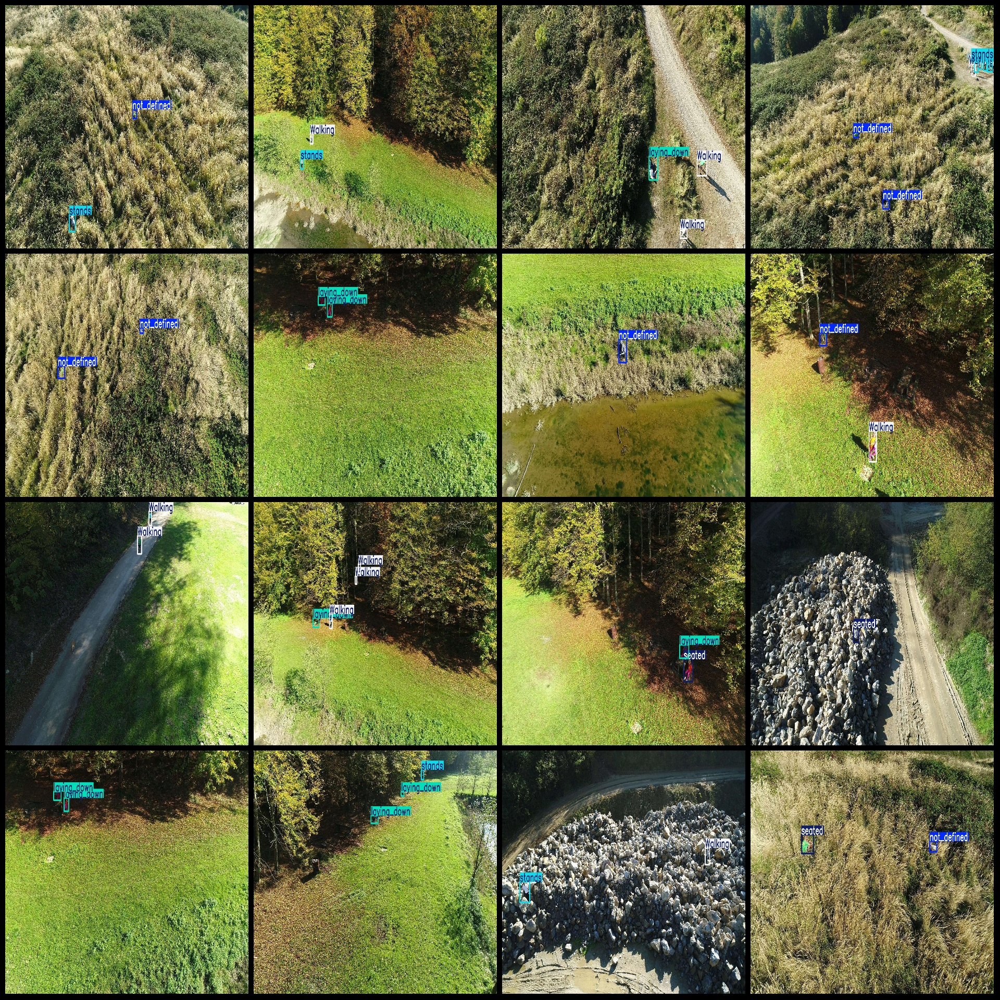

# 基于yolov11的山林搜索与救援失踪被困人员检测系统python源码+pytorch模型+评估指标曲线+精美GUI界面

【算法介绍】

基于YOLOv11的山林搜索与救援人员状态检测系统，通过集成深度学习目标检测与姿态分析技术，实现高精度实时定位与行为识别。该系统依托YOLOv11算法改进的骨干网络与颈部架构，显著增强复杂环境下的特征提取能力，可准确识别"Running（奔跑）""Walking（行走）""Laying_down（躺卧）""Seated（坐姿）""Stands（站立）"及未定义状态（Not_defined）六类人体姿态。

系统通过深度学习技术，结合大规模标注数据集进行模型训练，优化了特征提取与检测精度。YOLOv11采用改进的骨干网络和颈部架构，增强了复杂场景下的特征识别能力，同时减少参数数量以提升推理速度。用户可通过图形化界面（pyqt5设计）上传山林图像，系统实时输出病害类型、位置及置信度与结果可视化。

该系统的核心优势在于快速部署与高准确率，适用于无人机部署。通过识别，可及时搜索失踪被困人员。此外，模型支持持续优化，可通过新增数据微调以适应不同山林环境，为精准救援提供高精度识别解决方案。

【效果展示】

<div style="text-align:center;"><br>
&nbsp;</div>

<div style="text-align:center;">&nbsp;</div>


【测试环境】

windows10
anaconda3+python3.8
torch==2.3.0
ultralytics==8.3.81

【模型可以检测出类别】

Running（奔跑）""Walking（行走）""Laying_down（躺卧）""Seated（坐姿）""Stands（站立）"及未定义状态（Not_defined）六类人体姿态

【训练数据集介绍】

数据集格式：Pascal VOC格式+YOLO格式(不包含分割路径的txt文件，仅仅包含jpg图片以及对应的VOC格式xml文件和yolo格式txt文件)

图片数量(jpg文件个数)：1976

标注数量(xml文件个数)：1976

标注数量(txt文件个数)：1976

标注类别数：6

标注类别名称(注意yolo格式类别顺序不和这个对应，而以labels文件夹classes.txt为准):["Running","Walking","laying_down","not_defined","seated","stands"]

每个类别标注的框数：

Running 框数 = 78

Walking 框数 = 1288

laying_down 框数 = 1570

not_defined 框数 = 974

seated 框数 = 621

stands 框数 = 1823

总框数：6354

使用标注工具：labelImg

标注规则：对类别进行画矩形框

重要说明：暂无

特别声明：本数据集不对训练的模型或者权重文件精度作任何保证，数据集只提供准确且合理标注

图片预览：

<div style="text-align:center;"><br></div>

标注例子：



【训练信息】

| 参数 | 值 |
|:---:|:---:|
| 训练集图片数 | 1342 |
| 验证集图片数 | 401 |
| 训练map | 76.8% |
| 训练精度(Precision) | 73.3% |
| 训练召回率(Recall) | 74.2% |

【验证集精度统计】

| Class | Images | Instances | P | R | mAP50 | mAP50-95 |
|:---:|:---:|:---:|:---:|:---:|:---:|:---:|
| all | 401 | 1325 | 0.733 | 0.742 | 0.768 | 0.452 |
| Running | 17 | 23 | 0.636 | 0.38 | 0.43 | 0.182 |
| Walking | 148 | 268 | 0.594 | 0.761 | 0.769 | 0.426 |
| laying_down | 228 | 323 | 0.869 | 0.957 | 0.964 | 0.679 |
| not_defined | 146 | 191 | 0.737 | 0.738 | 0.776 | 0.407 |
| seated | 134 | 139 | 0.887 | 0.901 | 0.933 | 0.587 |
| stands | 195 | 381 | 0.675 | 0.716 | 0.733 | 0.433 |

【界面设计】

```
class Ui_MainWindow(QtWidgets.QMainWindow):
    signal = QtCore.pyqtSignal(str, str)
 
    def setupUi(self):
        self.setObjectName("MainWindow")
        self.resize(1280, 728)
        self.centralwidget = QtWidgets.QWidget(self)
        self.centralwidget.setObjectName("centralwidget")
 
        self.weights_dir = './weights'
 
        self.picture = QtWidgets.QLabel(self.centralwidget)
        self.picture.setGeometry(QtCore.QRect(260, 10, 1010, 630))
        self.picture.setStyleSheet("background:black")
        self.picture.setObjectName("picture")
        self.picture.setScaledContents(True)
        self.label_2 = QtWidgets.QLabel(self.centralwidget)
        self.label_2.setGeometry(QtCore.QRect(10, 10, 81, 21))
        self.label_2.setObjectName("label_2")
        self.cb_weights = QtWidgets.QComboBox(self.centralwidget)
        self.cb_weights.setGeometry(QtCore.QRect(10, 40, 241, 21))
        self.cb_weights.setObjectName("cb_weights")
        self.cb_weights.currentIndexChanged.connect(self.cb_weights_changed)
 
        self.label_3 = QtWidgets.QLabel(self.centralwidget)
        self.label_3.setGeometry(QtCore.QRect(10, 70, 72, 21))
        self.label_3.setObjectName("label_3")
        self.hs_conf = QtWidgets.QSlider(self.centralwidget)
        self.hs_conf.setGeometry(QtCore.QRect(10, 100, 181, 22))
        self.hs_conf.setProperty("value", 25)
        self.hs_conf.setOrientation(QtCore.Qt.Horizontal)
        self.hs_conf.setObjectName("hs_conf")
        self.hs_conf.valueChanged.connect(self.conf_change)
        self.dsb_conf = QtWidgets.QDoubleSpinBox(self.centralwidget)
        self.dsb_conf.setGeometry(QtCore.QRect(200, 100, 51, 22))
        self.dsb_conf.setMaximum(1.0)
        self.dsb_conf.setSingleStep(0.01)
        self.dsb_conf.setProperty("value", 0.25)
        self.dsb_conf.setObjectName("dsb_conf")
        self.dsb_conf.valueChanged.connect(self.dsb_conf_change)
        self.dsb_iou = QtWidgets.QDoubleSpinBox(self.centralwidget)
        self.dsb_iou.setGeometry(QtCore.QRect(200, 160, 51, 22))
        self.dsb_iou.setMaximum(1.0)
        self.dsb_iou.setSingleStep(0.01)
        self.dsb_iou.setProperty("value", 0.45)
        self.dsb_iou.setObjectName("dsb_iou")
        self.dsb_iou.valueChanged.connect(self.dsb_iou_change)
        self.hs_iou = QtWidgets.QSlider(self.centralwidget)
        self.hs_iou.setGeometry(QtCore.QRect(10, 160, 181, 22))
        self.hs_iou.setProperty("value", 45)
        self.hs_iou.setOrientation(QtCore.Qt.Horizontal)
        self.hs_iou.setObjectName("hs_iou")
        self.hs_iou.valueChanged.connect(self.iou_change)
        self.label_4 = QtWidgets.QLabel(self.centralwidget)
        self.label_4.setGeometry(QtCore.QRect(10, 130, 72, 21))
        self.label_4.setObjectName("label_4")
        self.label_5 = QtWidgets.QLabel(self.centralwidget)
        self.label_5.setGeometry(QtCore.QRect(10, 210, 72, 21))
        self.label_5.setObjectName("label_5")
        self.le_res = QtWidgets.QTextEdit(self.centralwidget)
        self.le_res.setGeometry(QtCore.QRect(10, 240, 241, 400))
        self.le_res.setObjectName("le_res")
        self.setCentralWidget(self.centralwidget)
        self.menubar = QtWidgets.QMenuBar(self)
        self.menubar.setGeometry(QtCore.QRect(0, 0, 1110, 30))
        self.menubar.setObjectName("menubar")
        self.setMenuBar(self.menubar)
        self.statusbar = QtWidgets.QStatusBar(self)
        self.statusbar.setObjectName("statusbar")
        self.setStatusBar(self.statusbar)
        self.toolBar = QtWidgets.QToolBar(self)
        self.toolBar.setToolButtonStyle(QtCore.Qt.ToolButtonTextBesideIcon)
        self.toolBar.setObjectName("toolBar")
        self.addToolBar(QtCore.Qt.TopToolBarArea, self.toolBar)
        self.actionopenpic = QtWidgets.QAction(self)
        icon = QtGui.QIcon()
        icon.addPixmap(QtGui.QPixmap(":/images/1.png"), QtGui.QIcon.Normal, QtGui.QIcon.Off)
        self.actionopenpic.setIcon(icon)
        self.actionopenpic.setObjectName("actionopenpic")
        self.actionopenpic.triggered.connect(self.open_image)
        self.action = QtWidgets.QAction(self)
        icon1 = QtGui.QIcon()
        icon1.addPixmap(QtGui.QPixmap(":/images/2.png"), QtGui.QIcon.Normal, QtGui.QIcon.Off)
        self.action.setIcon(icon1)
        self.action.setObjectName("action")
        self.action.triggered.connect(self.open_video)
        self.action_2 = QtWidgets.QAction(self)
        icon2 = QtGui.QIcon()
        icon2.addPixmap(QtGui.QPixmap(":/images/3.png"), QtGui.QIcon.Normal, QtGui.QIcon.Off)
        self.action_2.setIcon(icon2)
        self.action_2.setObjectName("action_2")
        self.action_2.triggered.connect(self.open_camera)
 
        self.actionexit = QtWidgets.QAction(self)
        icon3 = QtGui.QIcon()
        icon3.addPixmap(QtGui.QPixmap(":/images/4.png"), QtGui.QIcon.Normal, QtGui.QIcon.Off)
        self.actionexit.setIcon(icon3)
        self.actionexit.setObjectName("actionexit")
        self.actionexit.triggered.connect(self.exit)
 
        self.toolBar.addAction(self.actionopenpic)
        self.toolBar.addAction(self.action)
        self.toolBar.addAction(self.action_2)
        self.toolBar.addAction(self.actionexit)
 
        self.retranslateUi()
        QtCore.QMetaObject.connectSlotsByName(self)
        self.init_all()
```


【常用评估参数介绍】

在目标检测任务中，评估模型的性能是至关重要的。你提到的几个术语是评估模型性能的常用指标。下面是对这些术语的详细解释：

1.  **Class** ：

   - 这通常指的是模型被设计用来检测的目标类别。例如，一个模型可能被训练来检测车辆、行人或动物等不同类别的对象。

2.  **Images** ：

   - 表示验证集中的图片数量。验证集是用来评估模型性能的数据集，与训练集分开，以确保评估结果的公正性。

3.  **Instances** ：

   - 在所有图片中目标对象的总数。这包括了所有类别对象的总和，例如，如果验证集包含100张图片，每张图片平均有5个目标对象，则Instances为500。

4.  **P（精确度Precision）** ：

   - 精确度是模型预测为正样本的实例中，真正为正样本的比例。计算公式为：Precision = TP / (TP + FP)，其中TP表示真正例（True Positives），FP表示假正例（False Positives）。

5.  **R（召回率Recall）** ：

   - 召回率是所有真正的正样本中被模型正确预测为正样本的比例。计算公式为：Recall = TP / (TP + FN)，其中FN表示假负例（False Negatives）。

6.  **mAP50** ：

   - 表示在IoU（交并比）阈值为0.5时的平均精度（mean Average Precision）。IoU是衡量预测框和真实框重叠程度的指标。mAP是一个综合指标，考虑了精确度和召回率，用于评估模型在不同召回率水平上的性能。在IoU=0.5时，如果预测框与真实框的重叠程度达到或超过50%，则认为该预测是正确的。

7.  **mAP50-95** ：

   - 表示在IoU从0.5到0.95（间隔0.05）的范围内，模型的平均精度。这是一个更严格的评估标准，要求预测框与真实框的重叠程度更高。在目标检测任务中，更高的IoU阈值意味着模型需要更准确地定位目标对象。mAP50-95的计算考虑了从宽松到严格的多个IoU阈值，因此能够更全面地评估模型的性能。

这些指标共同构成了评估目标检测模型性能的重要框架。通过比较不同模型在这些指标上的表现，可以判断哪个模型在实际应用中可能更有效。

【使用步骤】

使用步骤：
（1）首先根据官方框架ultralytics安装教程安装好yolov11环境，并安装好pyqt5
（2）切换到自己安装的yolo11环境后，并切换到源码目录，执行python main.py即可运行启动界面，进行相应的操作即可

【提供文件】

python源码
yolo11n.pt模型
训练的map,P,R曲线图(在weights\results.png)
测试图片（在test_img文件夹下面）

注意提供训练的数据集，请到mytxt.txt文件中找到地址
<br>项目源码地址：https://mbd.pub/o/bread/YZWTlJdtag==
